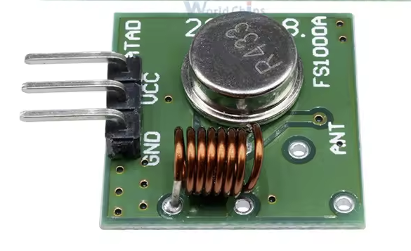
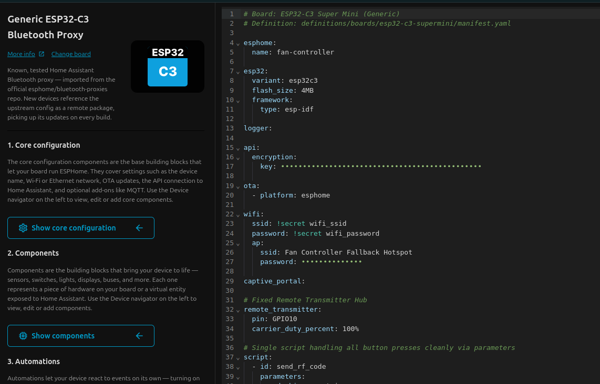
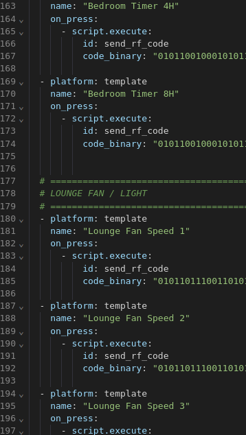
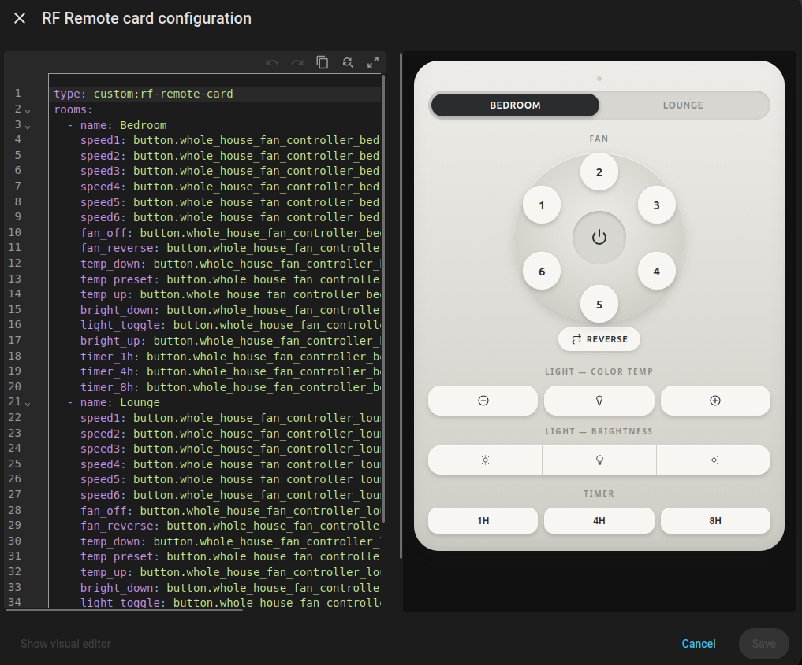
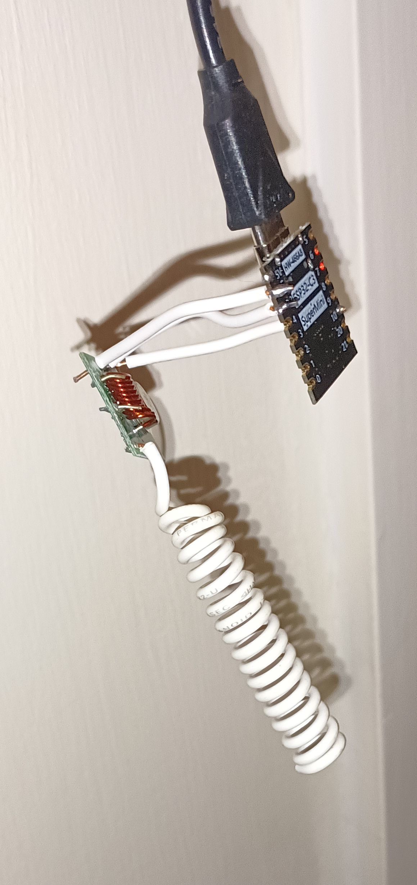

<h2>Home Assistant 433MHz Fan Control</h2>

This repo is a collection of helpers to turn a dumb ceiling fan with a 433MHz remote control into a 'smart' fan.

What you will need:
- An SDR capable of tuning to 433.92MHz. I have a Neoelec V5.
- An ESP board of your choice. I used an ESP-C3 supermini. Dirt cheap and you only need 1 output.
- An OOK 433MHz transmitter module.
- A bit of wire for an antenna if your module comes without one. 
- Linux with rtl-433

On Home Assistant you will need to install ESPHome

For the OOK (on-off shift keying) TX, the simpler the better. You can pick these up for less than a dollar.



<h2>Getting the codes</h2>
If you start this guide and get nothing, you may be on another frequency or not radio. See --- for info on determining the frequency of your remote.

Open a linux terminal. If you don't have rtl-344, install it. On Debian, Ubuntu, Mint and other deb based run
```
sudo apt update
sudo apt install rtl-433
```
To get the codes from the air enter
```
rtl_433 -f 433.92M -g 30 -A 2>&1 | tee capture.txt 
```

You should see something like
```
rtl_433 version 23.11 (2023-11-28) inputs file rtl_tcp RTL-SDR SoapySDR
Found Rafael Micro R820T tuner
[SDR] Using device 0: Nooelec, NESDR SMArt v5, SN: 14234960, "Generic RTL2832U OEM"
Exact sample rate is: 250000.000414 Hz
[R82XX] PLL not locked!
Allocating 15 zero-copy buffers
```

Decide which order you are going to press the button in and enter them into text file, one on each line, as the description you would like to see. Look in the examples folder for an idea. 
Press the first button and you should see something like 
```
Detected OOK package	2026-08-30 12:07:45
Analyzing pulses...
Total count:  329,  width: 528.64 ms		(132161 S)
Pulse width distribution:
 [ 0] count:  179,  width:  408 us [396;428]	( 102 S)
 [ 1] count:  150,  width: 1096 us [1080;1112]	( 274 S)
Gap width distribution:
 [ 0] count:  169,  width: 1092 us [1072;1156]	( 273 S)
 [ 1] count:  150,  width:  400 us [388;412]	( 100 S)
 [ 2] count:    9,  width: 5040 us [5032;5048]	(1260 S)
Pulse period distribution:
 [ 0] count:  319,  width: 1500 us [1484;1564]	( 375 S)
 [ 1] count:    9,  width: 5456 us [5448;5468]	(1364 S)
Pulse timing distribution:
 [ 0] count:  329,  width:  404 us [388;428]	( 101 S)
 [ 1] count:  319,  width: 1092 us [1072;1156]	( 273 S)
 [ 2] count:    9,  width: 5040 us [5032;5048]	(1260 S)
 [ 3] count:    1,  width: 11124 us [11124;11124]	(2781 S)
Level estimates [high, low]:   1000,      5
RSSI: -12.1 dB SNR: 23.0 dB Noise: -35.2 dB
Frequency offsets [F1, F2]:    1496,      0	(+5.7 kHz, +0.0 kHz)
Guessing modulation: Pulse Width Modulation with multiple packets
Attempting demodulation... short_width: 408, long_width: 1096, reset_limit: 5052, sync_width: 0
Use a flex decoder with -X 'n=name,m=OOK_PWM,s=408,l=1096,r=5052,g=1160,t=275,y=0'
[pulse_slicer_pwm] Analyzer Device
codes     : {33}b4cd71978, {33}b4cd71978, {33}b4cd71978, {33}b4cd71978, {33}b4cd71978, {33}b4cd71978, {33}b4cd71978, {33}b4cd71978, {33}b4cd71978, {32}b4cd7197

```
It's important to have the {33} codes and short_width, long_width, reset_limit and sync width. The 33 bit codes starting with {33} are the remote codes. If yours are not {33}, you will need to edit the python script to adapt to your bit count. 
If you see something bonkers like {288}, get the remote closer to your SDR antenna. The last code may often be a bit or 2 short like {32}. That's normal for these cheapo remotes. 
If all is good, continue pressing the buttons in the correct order. If not, ctrl-c to exit and start the capture again.
Allow about 2 to 3 seconds between each button press. When finished, ctrl-c to exit.
Repeat the process for additional fans of the same make and model using different file names.

<h2>Conversion</h2>
Once you have the data and your descriptions file, run the YAML generation, something like this.

```
python3 codes.py testremote capture.txt fan-buttons-desc.txt testfan.yml --one-per-line
```
The command line options are in the .py file. Basic operation is

```
python3 codes.py <fan-name> <path-to-capture-file> <path-to-description-file> <output> --one-per-line
```

where --one-per-line means you have multiple repeats like our example above where the code repeats for a block of 8 in total. 

You will then get your output YAML to copy/paste into ESPHome. You'll need to follow other guides on setting up ESPHome, the device builder, your API key etc. as that is outside of the scope of this repo.

The YAML forms the 'script' part of the ESPHome device. There are other settings that need to go in above script like this



It's important to have the top block looking something like this with remote_transmitter being essential. The GPIO pin is what you solder the RF transmitter data pin to.
You can add additional fans to the same ESPby just copying over the button definitions. It's the name part that is important to separate them.



Follow ESPHome guides on how to flash to your ESP chip. Once it is live and connected, the entities should appear in home assistant entities. You'll need the full names to setup the card.

<h2>Card Setup</h2>
NOTE: This JS is entirely AI generated. JS ain't my bag baby :) It's all Claude's work. You should be able to make simple edits on the free tier of Claude. 

In the src folder is a js file. You will need to go into the home assistant file editor and copy it into the www folder of homeassistant.
Restart and it will become available. 
You can now edit a dashboard and add the custom card. It needs to be edited in YAML like this



I've got 2 fans defined on the same ESP here under rooms:

<h2>Hardware</h2>
Most ESP chips run on 3.3v even when powered by USB. It is very important to use 3.3V from the ESP to power the TX module as a voltage mismatch between VCC and DATA can cause problems. 
For the Antenna, about 17cm of solid core wire is needed. You can form it around a pencil if it is insulated wire and make a helical antenna. Solder this to the antenna pad.
On my C3, I chose GPIO10 as that is a suitable pin. ESPHome will tell you what pins you can/can't use.
GND goes to a GND pin. It ain't pretty but this is mine



All programmed via ESPHome.

If all went well, your fans should be working via home assistant.

<h2>Not 433MHz</h2>
To determine the frequency of your remote, you'll need to crack it open. AI is your friend here so you don't have to go digging through data sheets. Most remotes will have a main chip, might be under a blob of black glue. The RF section is normally separate and hopefully you'll see a small chip with a small metal can next to it, that's the crystal oscillator. It will also have a long or squiggly trace on the circuit board that goes nowhere. That's the antenna. In my case it is 13.560MHz next to a 4455TDN which performs a x32 operation giving 433.92MHz.


You'll need to adjust the rtl_433 command, possibly the resolution. Ask an AI. Duck AI has been pretty useful to me throughout this process. 